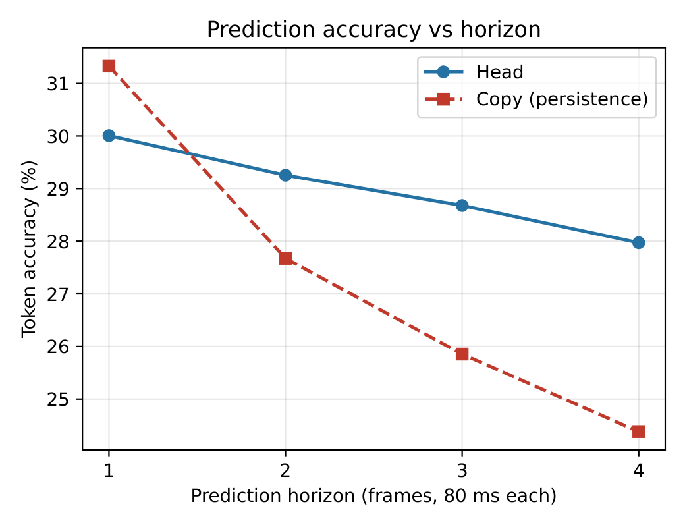
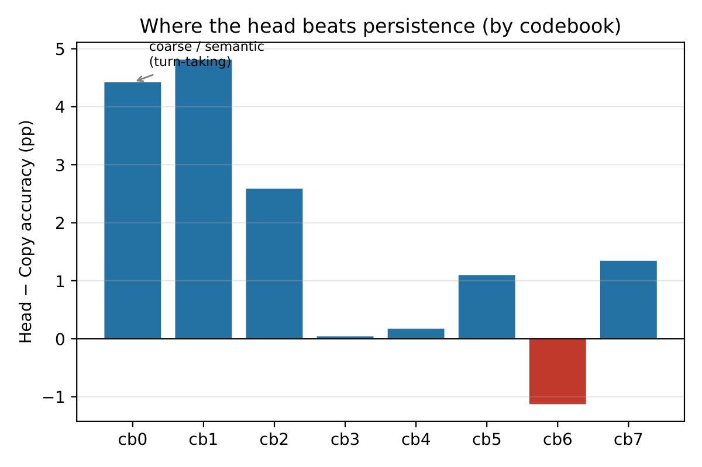
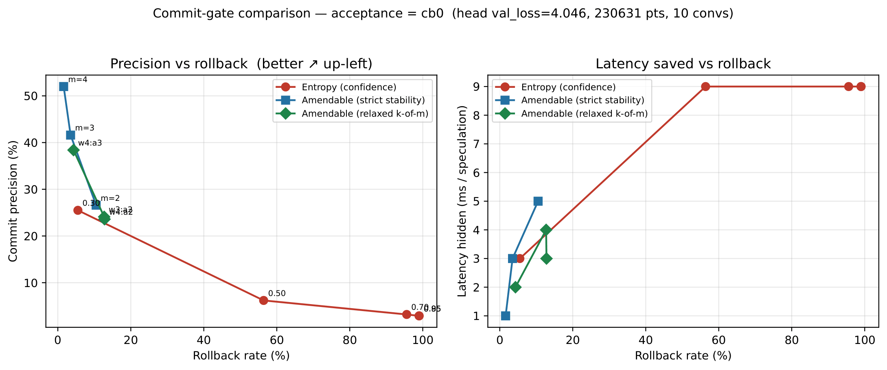
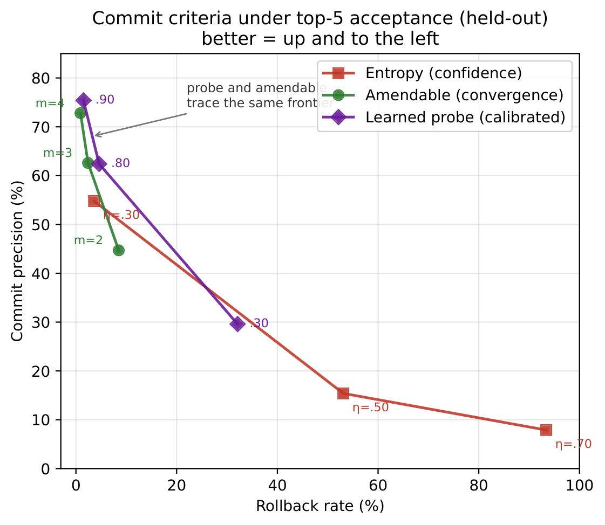
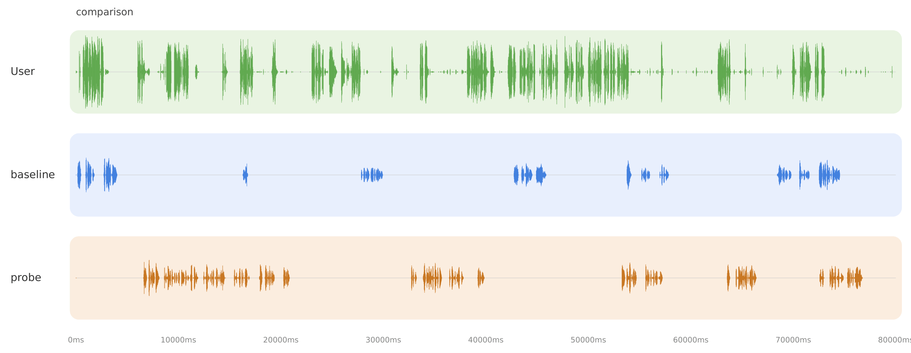

# Towards Zero-Latency Handoff
### Speculative Semantic Lookahead in Lightweight Full-Duplex Dialogue Systems

MSc Artificial Intelligence dissertation — Queen Mary University of London
**Author:** Edson da Silva Jose Casimiro · **Supervisor:** Prof. Matthew Purver

---

## Overview

Humans take conversational turns with gaps of ~200 ms by *anticipating* turn completion;
full-duplex dialogue systems instead react, incurring a latency floor. This project studies
**speculative semantic lookahead**: predicting upcoming conversational frames so a response can be
prepared in advance, and — crucially — deciding **when it is safe to commit** to a prediction when
there is no ground-truth verifier.

The central contribution is an **amendable commit criterion**: a frame is committed only once its
prediction *converges* across successive, better-informed vantage points, rather than when the
model is merely confident. We extend next-token-pair prediction to a multi-step head over a
**frozen** Moshi backbone, evaluate offline on held-out CANDOR conversations, add a **learned
probe** that recovers the same frontier under top-5 acceptance, and deploy the criterion as a
**live real-time trigger**.

> **Headline results** (held-out, 230,631 speculation points):
> - Amendable criterion: **52% commit precision at 1.6% rollback** (strict exact-match), where a
>   confidence baseline collapses.
> - Learned probe (top-5): **75.4% precision at 1.5% rollback**, matching the amendable frontier.
> - Live trigger (16 clips, 2 conversations): modest but consistent shift toward more responsive,
>   lower-overlap turn-taking.

---

## 📦 Large files (models, tokens, features) — download links

The repository contains **code only**. The data, cached features, and trained checkpoints are too
large for GitHub and are hosted externally. Download them and place them as indicated.

| Item | Description | Link | Place at |
|------|-------------|------|----------|
| Trained head (`head_v0.pt`) | The independent multi-step head (v0) | `https://drive.google.com/file/d/1ODFUyL7B9iuHm16fHp-X61gvl7hYoaGX/view?usp=drive_link` | repo root |
| Learned probe (`probe_top5.npz`) | Logistic-regression commit probe | `https://drive.google.com/file/d/1nlLQHoiLC8oB6iLUr8cHarpCTXeisLVv/view?usp=drive_link` | repo root |
| Train tokens (`tokens/`) | 40 tokenised train conversations (`.npy`) + manifest | `https://drive.google.com/drive/folders/1LknzL2-20Gf0_OO-ur0wz_PpOJ2mG-Yq?usp=sharing` | `tokens/` |
| Eval tokens (`tokens_eval/`) | 10 held-out tokenised conversations | `https://drive.google.com/drive/folders/1MhpvJ-2MfksxWBJf-NexAxOOJB3HbEru?usp=drive_link` | `tokens_eval/` |
| Train features (`pairs/`) | Cached backbone features + targets | `https://drive.google.com/drive/folders/1jWx45yWt1-SZ5lilWtALpohNHYDqlRul?usp=sharing` | `pairs/` |
| Eval features (`pairs_eval/`) | Held-out features (`.npz`) | `https://drive.google.com/drive/folders/1dp3S4jfBsEkGXBT8pL0r27oL2Od2qy_0?usp=sharing` | `pairs_eval/` |
| Handoff labels (`handoff_labels_eval/`) | CANDOR turn-change frames | `https://drive.google.com/drive/folders/1R6E9tOnvGRytPiTqr7PNTKjhA5UYUjRE?usp=sharing` | `handoff_labels_eval/` |
| Demo audio (optional) | Pre-generated baseline/probe clips | `https://drive.google.com/file/d/1a7hBr61tYVnlWRN-j38IYPJyqBrRErvk/view?usp=sharing` | `demo_audio/` |

> The Moshi backbone (`kyutai/moshiko-pytorch-q8`) is **not** hosted here — it downloads
> automatically from Hugging Face on first run.

---

## 🎧 Audio demonstration

Audio A/B comparison clips (baseline vs probe, one loud / one quiet for easy comparison):
`https://drive.google.com/file/d/1a7hBr61tYVnlWRN-j38IYPJyqBrRErvk/view?usp=sharing`

---

## Setup

```bash
# 1. clone
git clone https://github.com/HiEdson/MSc-AI-dissertation-shared-code.git && cd MSc-AI-dissertation-shared-code/duplex-spec

# 2. create the environment (Python 3.10+; a CUDA GPU with ~16 GB is expected)
python -m venv moshi-venv
source moshi-venv/bin/activate

# 2a. install torch for your CUDA build first (the RTX 2000 Ada / CUDA 12.x path used here)
pip install torch==2.9.1 --index-url https://download.pytorch.org/whl/cu128

# 2b. install everything else
pip install -r requirements.txt

# 3. download the large files (see table above) into the indicated folders
```

**Hardware:** all experiments run on a single **16 GB GPU** (RTX 2000 Ada). The backbone is frozen
and run once per conversation; only the lightweight head/probe are trained.

---

## Repository layout

```
src/duplex_spec/      core modules (multi-step head, gates)
scripts/              all experiment / evaluation / visualisation scripts
tokens/  tokens_eval/         tokenised CANDOR audio (download)
pairs/   pairs_eval/          cached backbone features + targets (download)
handoff_labels_eval/         CANDOR turn-change labels (download)
head_v0.pt  probe_top5.npz    trained checkpoints (download)
```

---

## A note on code structure

This repository has two layers:

- **`src/duplex_spec/` + `tests/`** — a clean, self-contained abstraction (`DuplexBackbone`,
  commit gates, multi-step head) with mock backbones, used for unit-testing the commit logic in
  isolation. This layer needs only `numpy` + `pytest`. Some backbone classes
  (`backbones/moshi.py`, `ntpp.py`) and `BackboneConsistencyGate` are intentionally left as
  stubs — they define the interface for future work (the independent-verifier direction) but are
  not used to produce the reported results.

- **`scripts/`** — the **real experimental pipeline** that produced all results in the
  dissertation. These call Moshi (`moshi.models.LMGen` / `loaders`) directly rather than through
  the `DuplexBackbone` abstraction, and require the full dependency set (`moshi`, `sphn`, `torch`,
  etc.). This is the code to run for reproduction.

---

## Reproducing the results

### Stage A–B — tokenisation & feature caching
Encode CANDOR audio to Mimi tokens and cache frozen-backbone features. *(If you downloaded the
`tokens*/` and `pairs*/` folders, skip to training/evaluation.)*

### 1. Train the multi-step head
```bash
PYTHONPATH=src python scripts/train_head.py \
  --pairs-dir pairs/ --out head_v0.pt --epochs 40 --device cuda
```

### 2. Prediction quality (Table I, Figs 1–2)
```bash
PYTHONPATH=src python scripts/greedy_acc.py \
  --head head_v0.pt --pairs-dir pairs_eval/ --device cuda
```
Reports per-horizon and per-codebook accuracy vs the persistence baseline.

### 3. Commit-gate comparison — strict cb0 (Table II, Fig 3)
```bash
PYTHONPATH=src python scripts/eval_speculative_topk.py \
  --head head_v0.pt --pairs-dir pairs_eval/ --device cuda \
  --accept cb0 --stability-m 2,3,4 --thresholds 0.3,0.5,0.7
```

### 4. Top-5 comparison + learned probe (Table `tab:probe`, probe frontier figure)
```bash
# train the probe (logistic regression over per-frame reliability signals)
PYTHONPATH=src python scripts/train_probe.py \
  --head head_v0.pt --pairs-dir pairs_eval/ --accept top5 --out probe_top5.npz

# evaluate all criteria under top-5
PYTHONPATH=src python scripts/eval_speculative_topk.py \
  --head head_v0.pt --pairs-dir pairs_eval/ --device cuda \
  --accept top5 --stability-m 2,3,4 --thresholds 0.3,0.5,0.7

# regenerate the probe-frontier figure
python scripts/fig_probe_frontier.py
```

### 5. Live trigger demonstration
```bash
# find lively windows (energy-based VAD)
PYTHONPATH=src python scripts/find_active.py \
  --tokens tokens_eval/<conv>.npy --win 200 --top 8 --device cuda

# generate baseline vs probe audio at chosen windows
PYTHONPATH=src python scripts/audio_demo_triggers.py \
  --tokens tokens_eval/<conv>.npy --feats pairs_eval/<conv>.npz \
  --labels handoff_labels_eval/<conv>.npz --head head_v0.pt \
  --triggers baseline,probe --probe probe_top5.npz \
  --probe-thr 0.7 --arm-silence 2 --temp 0.8 \
  --start <frame> --clip-frames 500 --device cuda --out demo_audio/

# turn-taking metrics (gap-fill, engage, overlap) across many clips
PYTHONPATH=src python scripts/batch_eval_v2.py \
  --tokens tokens_eval/<conv>.npy --feats pairs_eval/<conv>.npz \
  --labels handoff_labels_eval/<conv>.npz --head head_v0.pt --probe probe_top5.npz \
  --triggers baseline,probe --probe-thr 0.7 --arm-silence 2 \
  --starts <s1,s2,...> --clip-frames 500 --device cuda --out batch_out/

# visualise: user / baseline / probe as three waveform lanes
python scripts/viz_audio_shared.py \
  --audio demo_audio/<baseline>.wav demo_audio/<probe>.wav \
  --row-labels baseline,probe --shared-user --out figs/live_compare.svg

# A/B mix (both audible, one loud, one quiet) for perceptual comparison
python scripts/mix_ab.py \
  --baseline demo_audio/<baseline>.wav --probe demo_audio/<probe>.wav \
  --quiet-gain 0.3 --pan --out-dir demo_ab/
```

---

## Results

### 1. The head learns anticipatory structure
The head beats the persistence ("copy") baseline from horizon k2 (160 ms) onward — the range
relevant to hiding latency — with its advantage concentrated in the coarse, turn-taking-relevant
codebooks (cb0–cb2).




### 2. The amendable criterion dominates confidence
On the precision/rollback frontier (strict cb0 acceptance), the amendable criterion dominates the
entropy (confidence) gate across the whole range.



| Gate | Setting | Commit prec. | Rollback | Saved (ms) |
|------|---------|--------------|----------|------------|
| Entropy | η=0.30 | 25.5% | 5.5% | 3 |
| Entropy | η=0.50 | 6.2% | 56.4% | 9 |
| Entropy | η=0.70 | 3.2% | 95.6% | 9 |
| **Amendable** | **m=4** | **52.0%** | **1.6%** | **1** |
| Amendable | m=3 | 41.6% | 3.5% | 3 |
| Amendable | m=2 | 26.6% | 10.5% | 5 |

### 3. A learned probe recovers the frontier (top-5)
A logistic-regression probe over per-frame reliability signals (entropy, top-1 probability,
top1–top2 margin, inter-vantage divergence, horizon) recovers the same frontier as the
hand-designed criterion.



| Criterion | Setting | Precision | Rollback |
|-----------|---------|-----------|----------|
| Entropy | η=0.30 | 54.8% | 3.6% |
| Amendable | m=4 | 72.8% | 0.9% |
| Amendable | m=3 | 62.6% | 2.4% |
| **Probe** | **thr=0.90** | **75.4%** | **1.5%** |
| Probe | thr=0.80 | 62.4% | 4.6% |

### 4. Latency saved vs. rollback — the full picture
"Time saved" is the project's motivation, so we report it in full, **including** the aggressive
settings that hide more latency at the cost of high (unusable) rollback. More time *can* be hidden
— but only by committing recklessly. In the safe, low-rollback regime the task requires, all
criteria hide only 1–5 ms; the limit is **coverage**, not the 320 ms lookahead ceiling.

| Criterion | Setting | Saved (ms) | Rollback | Regime |
|-----------|---------|------------|----------|--------|
| Amendable | m=2 | 5 | 10.5% | safe |
| Amendable | m=3 | 3 | 3.5% | safe |
| Amendable | m=4 | 1 | 1.6% | safe |
| **Probe** | **thr=0.30** | **21** | **32.1%** | aggressive (high rollback) |
| Entropy | η=0.50 | 9 | 56.4% | aggressive (high rollback) |
| Entropy | η=0.70 | 9 | 94.0% | aggressive (unusable) |

The 21 ms hidden by the probe at thr=0.30 is real, but comes at 32% rollback (frequent audible
corrections). This tradeoff is exactly why coverage — committing *more* frames without rollback —
is the key open problem.

### 5. Live turn-taking trigger
Deployed live and evaluated label-free over 16 clips from two held-out conversations, the probe
trigger shifts turn-taking consistently — more responsive and less barge-in — though modestly.



| Condition | Gap-fill (%) | Engage (%) | Overlap (%) |
|-----------|--------------|------------|-------------|
| Baseline (vanilla Moshi) | 13.5 ± 5.5 | 39.6 ± 15.5 | 7.8 ± 3.6 |
| Probe trigger | 14.7 ± 6.7 | 43.1 ± 18.7 | 6.0 ± 2.8 |

The effect is small and variable (a consistent *tendency*, not a significant improvement). It does
not reliably reduce raw latency: gating on commit-confidence fires readily for quick reactions but
does not decide to *hold the floor* through the uncertain frames a substantive turn needs — the
same coverage/turn-awareness gap seen offline.

---

## Key findings, honestly stated

- **Convergence beats confidence** as a commit signal — but a *calibrated* confidence probe
  recovers the same frontier, so the two are two routes to the same underlying signal.
- **Coverage, not the criterion, is the bottleneck.** Commits are precise but few; the ceiling
  lies in the frozen backbone (confirmed by ablations).
- **The live trigger helps responsiveness and overlap, not raw latency** — filling silences with
  substantive turns needs turn-initiation prediction (future work).

## Future work
- Parameter-efficient fine-tuning (LoRA) of the backbone's final blocks — the ceiling is the
  frozen representation.
- An independent verifier (backbone-consistency check) to replace the convergence proxy.
- Turn-initiation prediction (VAP-style) to raise coverage directly.

---

## Acknowledgements
Supervised by Prof. Matthew Purver. Built on the Moshi backbone (Défossez et al., 2024) and the
CANDOR corpus (Reece et al., 2023).
